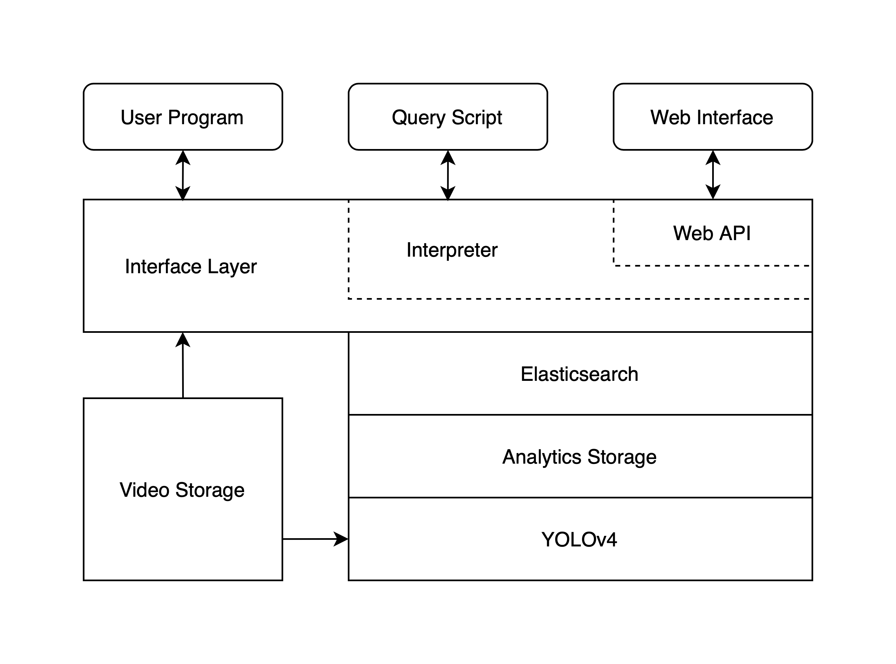

# Dexter
A novel, and fast search engine dedicated for video query. \
*This project is developed in collabration with Aditya Kuroodi and Joseph Ganley, 
original repo: [akuroodi/Object-Detection](https://github.com/akuroodi/Object-Detection)*

## Overview
Dexter is powered by YOLOv4 and DeepSORT to label + track objects from video. 
It is then built atop Elasticsearch in order to enable fast queries over videos via a web interface.
A high-level system diagram is shown below.

## Detailed Design
Please see our co-authored [paper](Dexter.pdf).

## Instructions for Demo
- Download and install [Elasticsearch](https://www.elastic.co/start)
- Start Elasticsearch: `$ elasticsearch`
- clone this repo and then: `$ cd ./Dexter/elasticsearchScripts`
- Initialize Elasticsearch: `$ sh ./initIndex.sh`
- Follow instructions in [dexter-web](dexter-web) to start Dexter web interface
